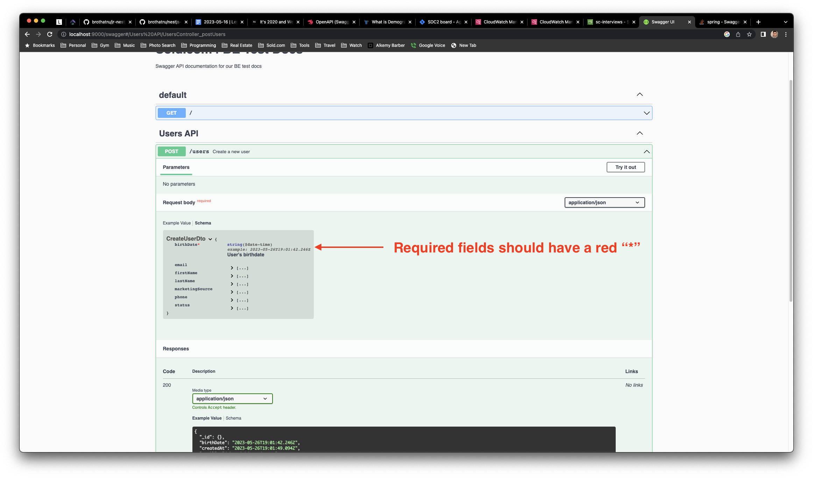

## Intro

This take-home project will test your back-end coding abilities. We will be evaulating how well directions can be followed including setting up the project, how quickly you can learn & adapt to a new framework, as well as document and follow best practices.

This project will consist of importing a CSV file of users into mongo, creating a REST API with basic CRUD functionality and searching, validation, documenting endpoints using swagger, and aggregating user statistics.

Frameworks Used

- [NestJS](https://docs.nestjs.com/)

## Requirements

**Todos**

- [Intro](#intro)
- [Requirements](#requirements)
  - [Users Schema](#users-schema)
  - [REST API](#rest-api)
  - [Interceptor Logger](#interceptor-logger)
  - [Validation](#validation)
  - [Data Import](#data-import)
  - [Filtering, Sorting \& Pagination](#filtering-sorting--pagination)
- [Installation](#installation)
- [Running the app](#running-the-app)

### Users Schema

Create a new users schema using [nestjs/mongoose package](https://docs.nestjs.com/techniques/mongodb).

The user schema should contain AT LEAST the following properties:

- **\_id** (mongo object id)
- **firstName** _required_
- **lastName** _required_
- **email** _required_
- **phone** _required_
- **marketingSource** ("provider" column from users.csv)
- **birthDate** _required_
- **status**
- **createdAt**
- **updatedAt**
- **isDeleted**

To ensure performance, please add appropriate indexes where it makes sense.

To prevent duplicates, you will also want to ensure "unique"-ness where it makes sense.

### REST API

Please create a basic CRUD api with AT LEAST the following endpoints:

- POST /users (_create a new user_)
  - Should return new user
- GET /users (_fetch existing users_)
  - Should return an array of users
- PATCH /users/:\_id (_update a single user_)
  - Should return updated user
- DELETE /users/:\_id (_soft delete a single user - do NOT actually delete user from mongo_)
  - Should return soft deleted user

**_Note_: All api endpoints should NOT return soft deleted users.\***

### Interceptor Logger

There is a saying, "We live and die by our logs".

Without good logs, it becomes very difficult to troubleshoot any future issues or problems.

That is why we should set that up now.

Create a controller-level interceptor that will log AT LEAST the following logs in a single log statement (single-line):

**Request Log**

- Request ID
- HTTP Method
- URL Path
- Request Body (if exists)

```log
# Examples
[Nest] 64047  - 05/26/2023, 11:25:01 AM     LOG [UsersInterceptor] (MjAyMy0wNS0yNlQxODoyNTowMS45MTZa) GET /users {}
```

**Response Log**

- Request ID
- Response Status Code
- Response JSON (stringified)

```log
# Examples
[Nest] 64047  - 05/26/2023, 11:25:01 AM     LOG [UsersInterceptor] (MjAyMy0wNS0yNlQxODoyNTowMS45MTZa) []
```

**Recommended Reading**

- [NestJS Request Life Cycle](https://docs.nestjs.com/faq/request-lifecycle#summary)
- https://docs.nestjs.com/interceptors

### Validation

When building web applications, it is always a good idea to enable some basic validation.

The first thing to always check for is to NOT allow empty or null values.

We also don't want phone numbers with alphabetical letters or emails that are not correctly formatted email addresses.

This should be blocked not only at the REST API level, but also at the database level (hint: mongoose schema validation).

To do this, we use class validator decorators in NestJS (see recommended reading below).

Lastly, ensure any required or optional fields are also reflected in the swagger api docs.



**Recommended Reading**

- https://docs.nestjs.com/techniques/validation
- [Swagger Intro](https://docs.nestjs.com/openapi/introduction)

### Data Import

If you've gotten this far, it is now time to put your new api to the test.

Import all rows from users.csv file into our new users collection.

(This file will be sent as a separate attachment)

Create a new data seeding endpoint that will upload a CSV file and insert the new users.

POST /users/upload

**Extra Credit**

Extra points will be given for implementing a bulk insert.

### Filtering, Sorting & Pagination

For our REST api to be more useful, we need to be able to search and filter records we need.

Please update the GET /users endpoint, to accept url query parameters that allow for this ability.

For example, I want to be able to fetch records like so:

```log
GET /users?firstName=michael&sort=1&sortBy=lastName&limit=20&page=1
```

This will return the first 20 users with first name "michael", sorted by last name alphabetically.

**_Note_: All api endpoints should NOT return soft deleted users.\***

See interface here

## Installation

```bash
$ npm install
```

## Running the app

```bash
# development
$ npm run start

# watch mode
$ npm run start:dev

# production mode
$ npm run start:prod
```
