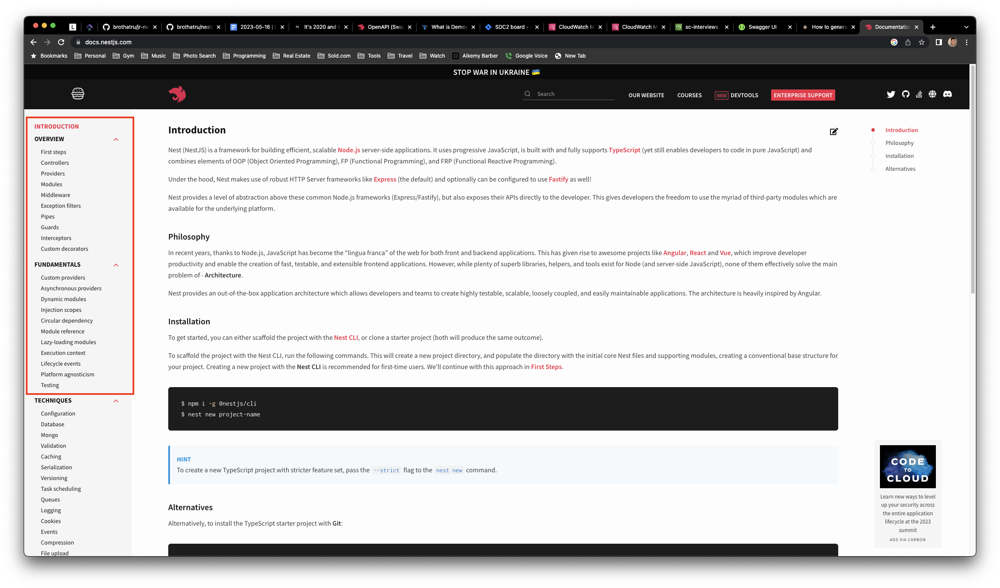

## Intro

This take-home project will test your back-end coding abilities. We will be evaulating how well directions can be followed including setting up the project, how quickly you can learn & adapt to a new framework, as well as document and follow best practices.

This project will consist of importing a CSV file of users into mongo, creating a REST API with basic CRUD functionality and searching, validation, documenting endpoints using swagger, and aggregating user statistics.

Frameworks Used

- [NestJS](https://docs.nestjs.com/)

This project was set up using Node version **v14.19.0**

I recommend installing [NVM (Node Version Manager)](https://github.com/nvm-sh/nvm#installing-and-updating) to manage different NodeJS versions locally.

## Installation / Set Up

### Install Mongo

Download and install the community edition of MongoDB from https://www.mongodb.com/docs/manual/installation/.

After installing, you'll want to start the service.

Next, download and install [Studio 3T](https://robomongo.org). This is a GUI for connecting to your Mongo database, and will allow you to query your database for easier debugging and troubleshooting.

Open up Studio 3T and connect to localhost:27017.

Once connected, go ahead and create a new database named "soldcom".


```bash
$ npm install
```

### Configuration / Environment Variables

Before starting the app, you'll need to create a new **.env** file in the root folder.

```dotenv
API_DOCS_PATH=swagger
MONGO_DB_URL=mongodb://localhost/soldcom
PORT=9000
```

See [.env.example](.env.example)

## Running the app

```bash
nest start -w
```

This will start a local server at http://localhost:9000/swagger

## Requirements

The **UsersModule** has already been set up for you and includes a bunch of helper classes.

**Todos**

- [Intro](#intro)
- [Installation / Set Up](#installation--set-up)
  - [Install Mongo](#install-mongo)
  - [Configuration / Environment Variables](#configuration--environment-variables)
- [Running the app](#running-the-app)
- [Requirements](#requirements)
  - [Users Schema](#users-schema)
  - [REST API](#rest-api)
  - [Interceptor Logger](#interceptor-logger)
  - [Validation](#validation)
  - [Data Import](#data-import)
  - [Filtering, Sorting \& Pagination](#filtering-sorting--pagination)
- [Cypress Tests](#cypress-tests)
- [Project Submission](#project-submission)
- [Questions](#questions)

After reviewing the todos, I suggest reviewing at least the following basics of NestJS.

It will definitely help with this project.

There are also plenty of tutorials and youtube videos online.

Other than that, happy coding!!!



https://docs.nestjs.com/first-steps

### Users Schema

Create a new users schema using [nestjs/mongoose package](https://docs.nestjs.com/techniques/mongodb).

The user schema should contain AT LEAST the following properties:

- **\_id** (mongo object id)
- **firstName** _required_
- **lastName** _required_
- **email** _required_
- **phone** _required_
- **marketingSource** ("provider" column from users.csv)
- **birthDate** _required_
- **status**
- **createdAt**
- **updatedAt**
- **isDeleted**

To ensure performance, please add appropriate indexes where it makes sense.

To prevent duplicates, you will also want to ensure "unique"-ness where it makes sense.

### REST API

Please create a basic CRUD api with AT LEAST the following endpoints:

- POST /users (_create a new user_)
  - Should return new user
- GET /users (_fetch existing users_)
  - Should return an array of users
- PATCH /users/:\_id (_update a single user_)
  - Should return updated user
- DELETE /users/:\_id (_soft delete a single user - do NOT actually delete user from mongo_)
  - Should return soft deleted user

**_Note_: All api endpoints should NOT return soft deleted users.\***

### Interceptor Logger

There is a saying, **_"We live and die by our logs"_**.

Without good logs, it becomes very difficult to troubleshoot any future issues or problems.

That is why we should set that up now.

Create a controller-level interceptor that will log AT LEAST the following logs in a single log statement (single-line):

**Request Log**

- Request ID
- HTTP Method
- URL Path
- Request Body (if exists)

```log
# Examples
[Nest] 64047  - 05/26/2023, 11:25:01 AM     LOG [UsersInterceptor] (MjAyMy0wNS0yNlQxODoyNTowMS45MTZa) GET /users {}
```

**Response Log**

- Request ID
- Response Status Code
- Response JSON (stringified)

```log
# Examples
[Nest] 64047  - 05/26/2023, 11:25:01 AM     LOG [UsersInterceptor] (MjAyMy0wNS0yNlQxODoyNTowMS45MTZa) []
```

**_Note\*: This has already been started for you_**

**Recommended Reading**

- [NestJS Request Life Cycle](https://docs.nestjs.com/faq/request-lifecycle#summary)
- https://docs.nestjs.com/interceptors

### Validation

When building web applications, it is always a good idea to enable some basic validation.

The first thing to always check for is to NOT allow empty or null values.

We also don't want phone numbers with alphabetical letters or emails that are not correctly formatted email addresses.

This should be blocked not only at the REST API level, but also at the database level (hint: mongoose schema validation).

To do this, we use class validator decorators in NestJS (see recommended reading below).

Lastly, ensure any required or optional fields are also reflected in the swagger api docs.


**Recommended Reading**

- https://docs.nestjs.com/techniques/validation
- [Swagger Intro](https://docs.nestjs.com/openapi/introduction)

### Data Import

Download and import all rows from [users.csv](https://sc-interviews.s3.amazonaws.com/users.csv.zip) file into our new users collection.

Create a new data seeding endpoint that will upload a CSV file and insert the new users.

```log
POST /users/upload
```

Should return success and failed count.

See [src/modules/users/dto/upload-users-response.dto.ts](src/modules/users/dto/upload-users-response.dto.ts)

**Bonus**

Extra points will be given for implementing a "bulk" insert, that inserts many at a time. Not just one user at a time.

### Filtering, Sorting & Pagination

For our REST api to be more useful, we need to be able to search and filter records we need.

Please update the GET /users endpoint, to accept url query parameters that allow for this ability.

For example, I want to be able to fetch records like so:

```log
GET /users?firstName=michael&sort=1&sortBy=lastName&limit=20&page=1
```

This will return the first 20 users with first name "michael", sorted by last name alphabetically.

Update the **GET /users** endpoint to return a paginated users response.

Default query values should be:

- page = 1
- sort = 1
- sortBy = 'createdAt'

Start by updating the api response type and return types of your `getUsers()` controller method:

```typescript
export class UsersController {
  // ... code

  @Get('/')
  @ApiOperation({ summary: `Return a list of users` })
  @ApiOkResponsePaginated(User)
  async getUsers(
    @Query() query: QueryUserDto,
  ): Promise<PaginatedResponseDto<User>> {
    /**
     * @todo
     * Add filter, sorting, pagination logic here
     */

    return new PaginatedResponseDto({
      data: [],
      limit: query.limit,
      page: query.page,
      sort: query.sort,
      sortBy: query.sortBy,
    });
  }
}
```

**_Note_: All api endpoints should NOT return soft deleted users.\***

See [Query User DTO (data transfer object) here](src/modules/users/dto/query-user.dto.ts)

## Cypress Tests

Here we use [Cypress Framework](https://www.cypress.io/) for running full end-to-end tests.

Please set up and install Cypress according to their docs.

Create 2 new specs (test files).

One will be an integration spec, and the other will be a full end-to-end spec testing the swagger docs UI.

For your integration spec, you should test all your endpoints.

I would also recommend testing different combinations of your filtering, sorting, and pagination.

**Integration Tests Example**

```typescript
describe(`Users API Integration Tests`, () => {
  it(`GET /users`, () => {
    cy.request({ url: 'http://localhost:9000/users', method: 'get' }).then(
      (res) => {
        expect(res.status).eq(200);
        expect(res.body.data.length).to.be.greaterThan(0);
      },
    );
  });

  it(`GET /users?firstName=John&limit=20&page=1&sort=-1&sortBy=createdAt`, () => {
    cy.request({
      url: 'http://localhost:9000/users?firstName=John&limit=20&page=1&sort=-1&sortBy=createdAt',
      method: 'get',
    }).then((res) => {
      expect(res.status).eq(200);
      expect(res.body.page).to.eq(1);
      expect(res.body.limit).to.eq(20);
      expect(res.body.sort).to.eq(-1);
      expect(res.body.sortBy).to.eq('createdAt');
      expect(res.body.data.length).to.be.greaterThan(0);
      expect(res.body.data.every((user) => user.firstName.match(/john/i)));
    });
  });
});
```

**E2E Tests Example**

For this spec, you will actually want to visit your swagger docs (http://localhost:9000/swagger#/) and click the buttons on the swagger docs UI, to execute queries and run your assertions.

```typescript
describe(`Users API E2E Test`, () => {
  it(`GET /users?firstName=John&limit=20&page=1&sort=-1&sortBy=createdAt)`, () => {
    cy.visit(
      `http://localhost:9000/swagger#/Users%20API/UsersController_getUsers`,
    );

    cy.get(
      '#operations-Users_API-UsersController_getUsers .try-out__btn',
    ).click();

    cy.get(
      '#operations-Users_API-UsersController_getUsers .body-param__text',
    ).type(
      JSON.stringify({
        birthDate: '2023-05-26T20:46:21.392Z',
        email: 'johnsmith@nestjs.com',
        firstName: 'John',
        lastName: 'Smith',
        marketingSource: 'string',
        phone: 'string',
        status: 'DQL',
      }),
    );

    cy.get('.execute').click();
  });
});
```

For this E2E test, it will be simplified.

You will only need to test the **GET /users** endpoint and it's UI interface.

## Project Submission

When you are done with this project, please submit a github url with the updated repo to the person who administered this test to you.

If private repo, please grant gitub access to the test administrator's email.

## Questions

If you have any questions, please feel free to reach out to the person who administered this test to you.
